# Операционные системы UNIX/Linux (Базовый)

> В этом отчёте представлены результаты выполнения проекта по основам администрирования Linux.  
> Вы проведёте установку сервера, создадите и настроите пользователя, пропишете сетевые параметры, выполните обновление системы и познакомитесь с ключевыми утилитами и сервисами: от `sudo` и редакторов до `sshd`, `cron` и работы с дисками.  
> Каждый раздел сопровождается чётким описанием действий и наглядными скриншотами.

## Part 1. Установка ОС

Установлена Ubuntu 20.04 Server LTS без графического интерфейса в VirtualBox.  
Версия ОС подтверждена командой `cat /etc/issue`.

Скриншоты:  
  

---

## Part 2. Создание пользователя

Создан новый пользователь `hallgath`, добавлен в группу `adm`.  
Проверка создания пользователя через вывод файла `/etc/passwd`.

Скриншоты:  

---

## Part 3. Настройка сети ОС

- Задано имя хоста вида `user-1`.
- Установлена временная зона, соответствующая текущему местоположению.
- Выведены названия сетевых интерфейсов. Объяснено наличие интерфейса `lo` (локальный loopback).
- Получен IP-адрес от DHCP-сервера, расшифровка DHCP (Dynamic Host Configuration Protocol).
- Определён внешний и внутренний IP-адрес шлюза.
- Заданы статичные IP, gateway и DNS (1.1.1.1 и 8.8.8.8).
- Перезагружена виртуальная машина, проверены настройки.
- Проверен пинг удалённых хостов (1.1.1.1 и ya.ru) с 0% потерь.

Скриншоты:  
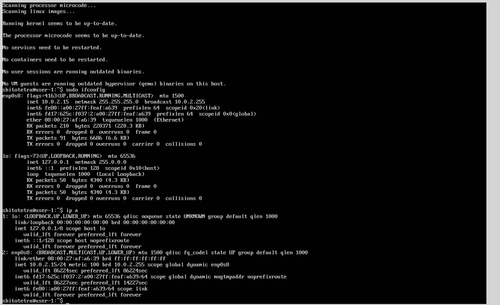  
  
  
  
  
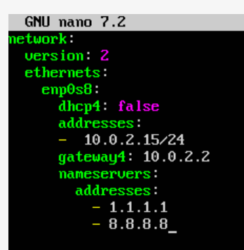  

---

## Part 4. Обновление ОС

Обновлены все системные пакеты до актуальной версии с помощью `apt update` и `apt upgrade`.  
Повторный запуск обновления показал отсутствие доступных обновлений.

Скриншоты:  

---

## Part 5. Использование команды sudo

Пользователь `hallgath` получил права на выполнение команд через `sudo`.  
Истинное назначение `sudo` — временное повышение прав без постоянного входа под root.  
С помощью `sudo` изменён hostname ОС от имени `hallgath`.

Скриншоты:  

---

## Part 6. Установка и настройка службы времени

Настроена автоматическая синхронизация времени с помощью systemd-timesyncd (NTP).  
Проверено время и часовой пояс: `timedatectl show` выводит `NTPSynchronized=yes`.

Скриншоты:  
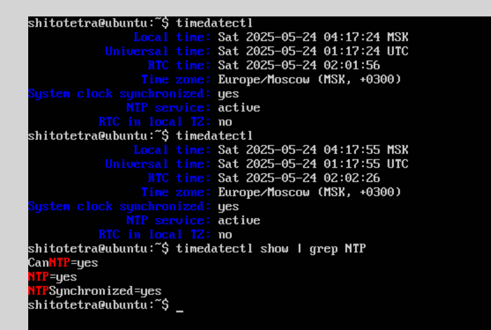

---

## Part 7. Установка и использование текстовых редакторов

- Установлены редакторы: VIM, nano, mc.
- Созданы файлы `test_vim.txt`, `test_nano.txt`, `test_mc.txt` с никнеймом.
- Файлы сохранены и заново отредактированы: поиск и замена слов в каждом редакторе.

Скриншоты:  
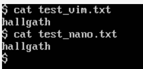  
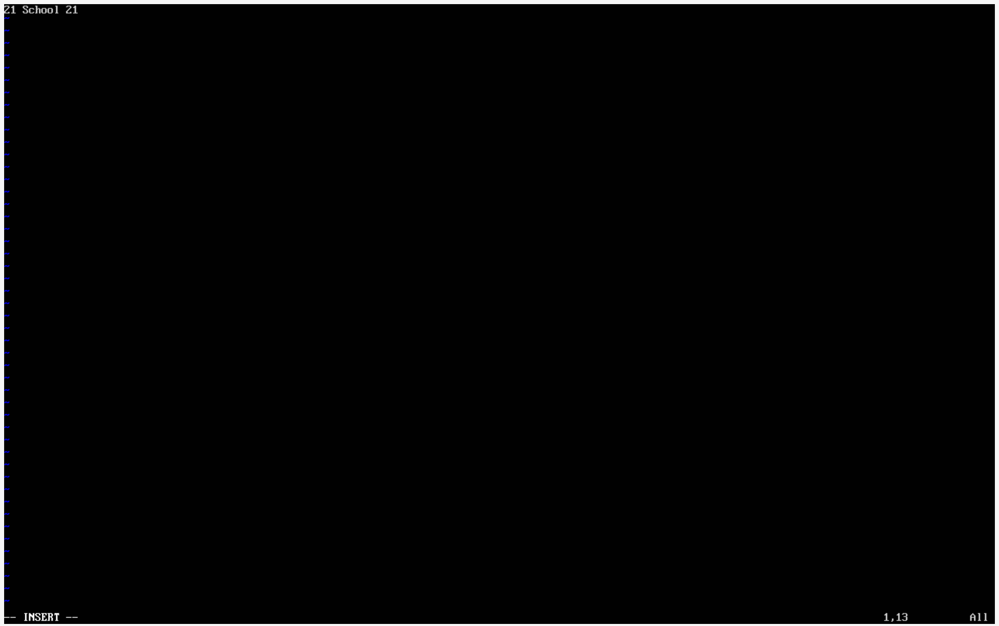  

---

## Part 8. Установка и базовая настройка сервиса SSHD

- Установлен и настроен автозапуск SSHd.
- Порт SSHd изменён на 2022.
- Проверен процесс `sshd` через `ps`.
- После перезагрузки подтверждена прослушка порта: `netstat -tan`.

Скриншоты:  
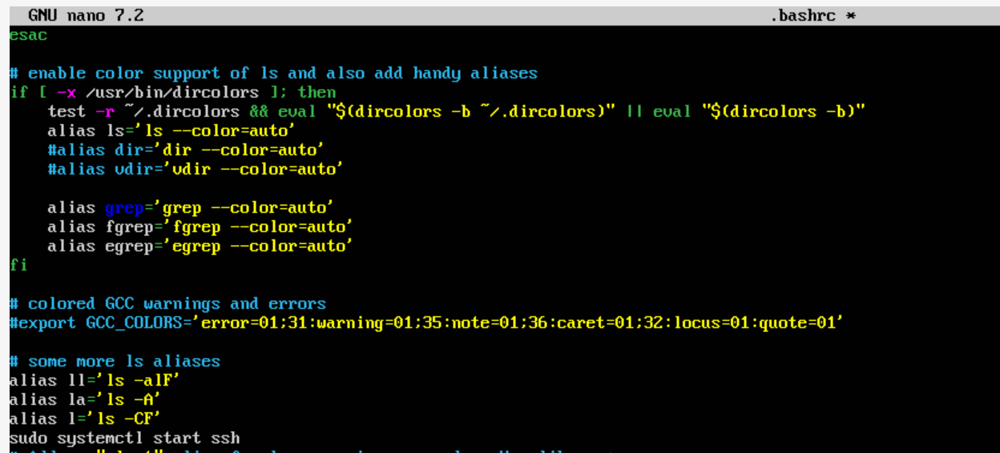  
  
  

---

## Part 9. Установка и использование утилит top, htop

- Установлены и запущены `top` и `htop`.
- По `top` определены загрузка, пользователи, процессы, CPU/память.
- В `htop` выполнены сортировки, фильтрация и поиск.

Скриншоты:  
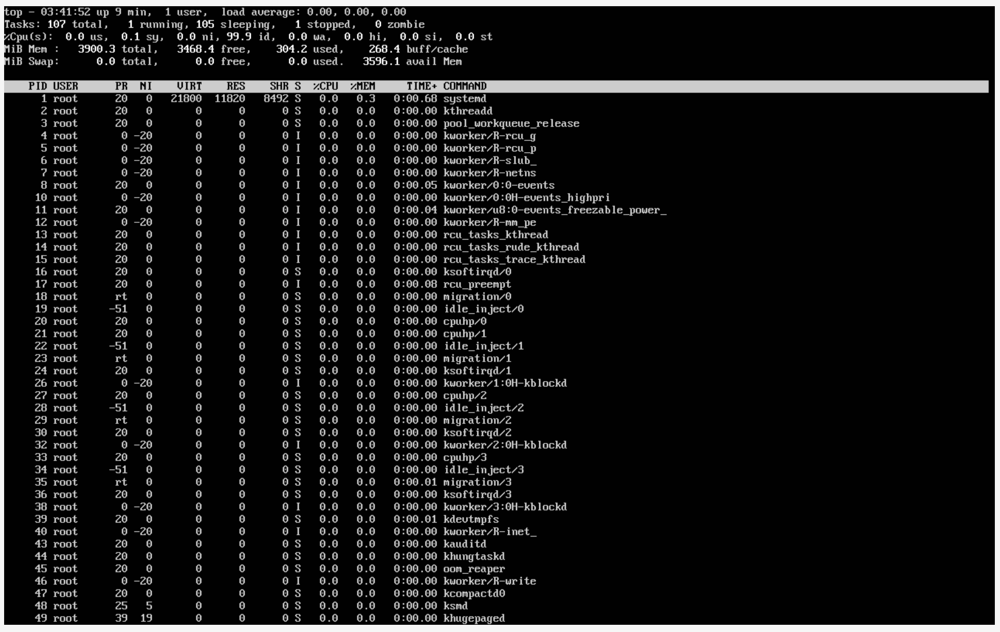  
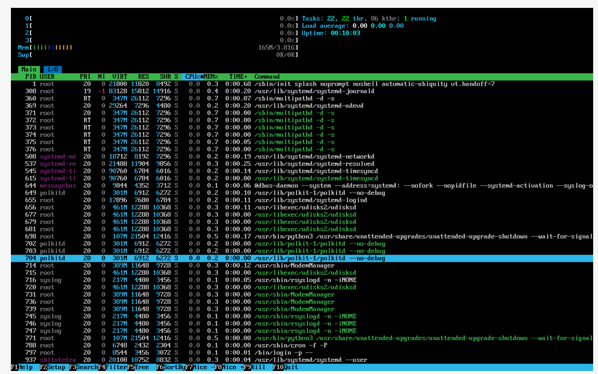

---

## Part 10. Использование утилиты fdisk

Выполнена команда `fdisk -l`.  
Определены имя диска, размер, количество секторов и размер swap-раздела.

Скриншоты:  
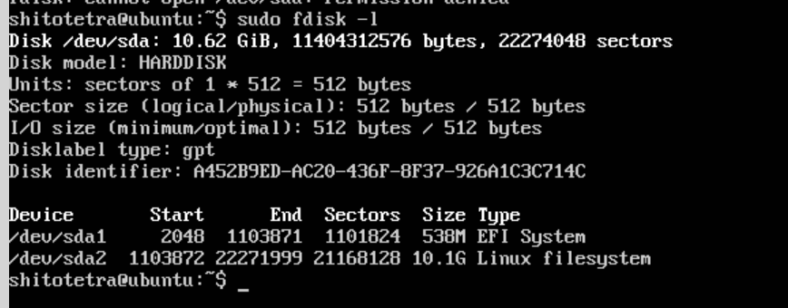

---

## Part 11. Использование утилиты df

- `df` показал размер, занятое и свободное пространство, процент использования корня (/).
- `df -Th` дополнил информацией о типе файловой системы.

Скриншоты:  
  
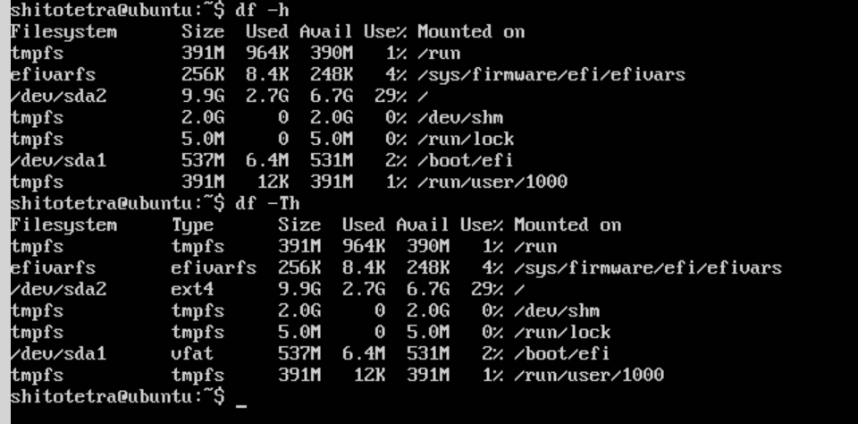  

---

## Part 12. Использование утилиты du

- `du` вывел размеры папок `/home`, `/var`, `/var/log` в байтах и человекочитаемом виде.
- Отдельно показаны размеры каждого элемента в `/var/log`.

Скриншоты:  
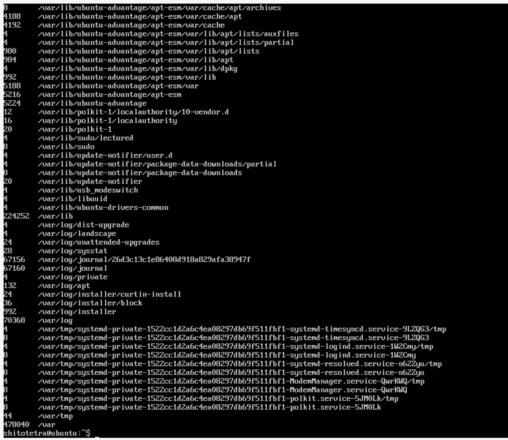  

---

## Part 13. Установка и использование утилиты ncdu

- Установлена `ncdu`.
- Выведены размеры папок для сверки с `du`.

Скриншоты:  
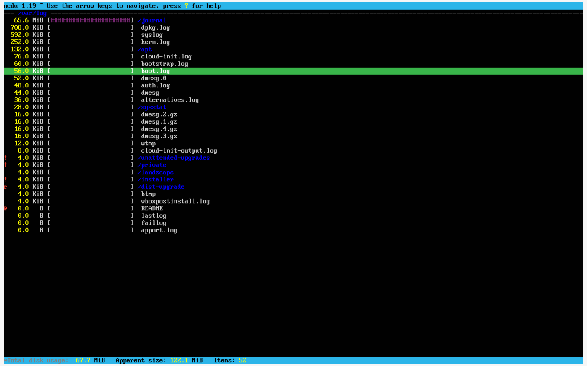

---

## Part 14. Работа с системными журналами

- Просмотрены логи: `/var/log/dmesg`, `/var/log/syslog`, `/var/log/auth.log`.
- Определено время последней авторизации, имя пользователя и метод входа.
- Перезапущен `sshd`, закреплено в логах.

Скриншоты:  
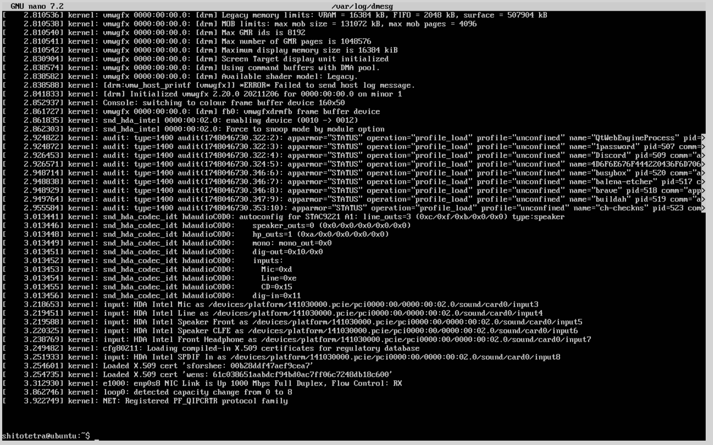  
  
  
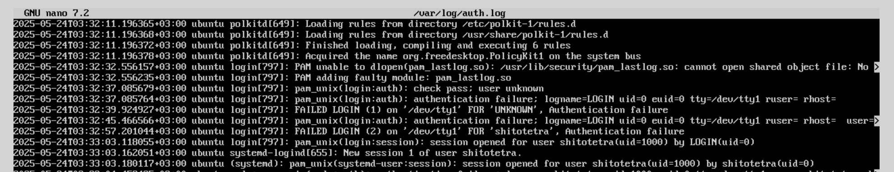

---

## Part 15. Использование планировщика заданий CRON

- Задача `uptime` запущена через каждые 2 минуты.
- Найдены записи в журналах.
- Показан и очищен список текущих заданий.

Скриншоты:  
  
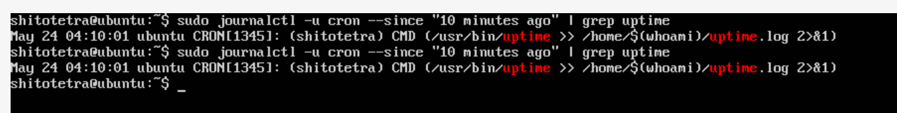  
  
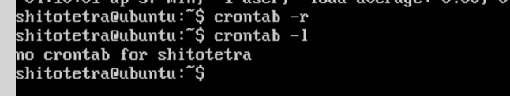

